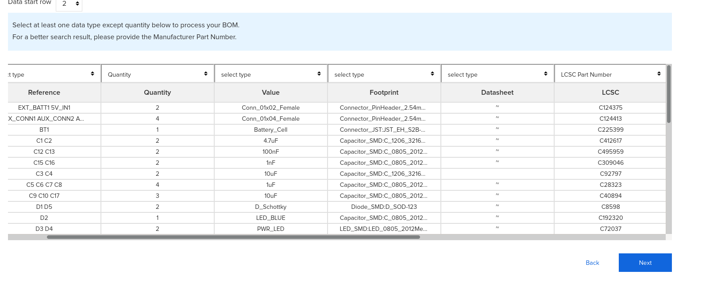

# Embedded, low cost, ESP32 Air Quality Cluster
## What more could you ask for?

## Note

This is currently in development, but you can

-[Read the abstract!](../../ABSTRACT.pdf)

-Check out the [pcb](../../boards/esp32/hardware/pcb/) and [enclosure](../../boards/esp32/hardware) designs!

-Take a look at the [firmware source code!](../../boards/esp32/firmware)

## Welcome!
Below are the steps to set up your very own ESP32-based DITAQM sensor cluster board!

To get a cluster board up and running, you have two options:

[Purchase a Pre-Built board (and support a high school air quality club!)](#pre-built)

[Build it from scratch (don't worry! It's not as hard as it might sound :))](#from-scratch)

## From Scratch!

### Step 1: Ordering the Components and PCBs
I have used [LCSC](https://lcsc.com) for the components and [JLCPCB](https://jlcpcb.com) for the PCBs during development, but there is nothing in the source files that will only work with those distributors. If you want the easiest possible experience, use either Mouser or LCSC for your components, because I have included distributor-specific part numbers for them in the BOM. Ok, let's get ordering!

#### Ordering the components
This will be a guide for ordering the components on LCSC, it is probably similar on any other major components distributor with a BOM tool.

1. Head over to [lcsc](https://lcsc.com) and click on BOM Tool

2. Download the [BOM](../../boards/esp32/hardware/pcb/bom.csv) and upload it to the site

3. Once you upload the BOM, you should see a spreadsheet appear. All you need to do is set the "quantity" column to "Quantity" and the "LCSC" column to "LCSC Part Number", as seen in the picture below  

5. Click next, and you will be shown a list of the items required for one unit. Keep in mind that many of the passive components (resistors, capacitors) require a minimum order quanity of between 20 and 100 units, but they cost fractions of cents so don't worry too much about it. Also consider that the BME680 and PMS7003 sensors are included in the LCSC bom, and are by far the most significiant contributors to price. If you laready have these sensors, take them off the list with the trashcan button and that should take your price down quite a bit. Next to the "Add to cart" button there is a multiplier, use that if you are ordering parts for multiple sensor clusters. Keep in mind that if you put, say, 100 qty for a component and multiply that by 4 orders, you will have 400 units in your cart, which is way over the order quantity. Keep that in mind when selecting component qunatities.

7. Once you're ready, you can add the components to cart and check out!

#### Ordering the PCBs
1. Head over to [JLCPCB](https://jlcpcb.com) and click on the big blue "QUOTE NOW" button

2. Download the [PCB Design Files](../../boards/esp32/hardware/pcb/src.zip), click "Add gerber file" and upload the src.zip you just downloaded.

3. Leave all options as default, this will ensure the fastest manfucaturing time and lowest cost

4. Save to cart and checkout!

**Note that JLCPCB will usually take around a week to arrive (with DHL shipping) while LCSC may take up to 2 and a half, depending on which shipping you chose and how long it takes to gather your components in the warehouse**

### Step 2: Assembling
I'll probably make a video on this just open the kicad and follow that or I'll make a key for component designators or smth

**IMPORTANT if you aren't getting any power from the Micro-USB/5V source, check to see if you installed diode D1 backwards! This has happened a few times to me and I only realized that it was the problem when the diode started heating up and I wasn't getting any voltage through the LDO regulator while powered off of the battery.

### Step 3: Flashing the Firmware
If you want, you can use an [esp32-wroom flashing device]() to flash the ESP32 before you solder it in. If you choose to assemble the cluster fully before flashing the firmware, follow the instructions below.

1. Download [esptool]((). This is the standard software package used to flash firmware to Espressif devices, including the ESP32 we are using.
2. Since there is no onboard usb-serial IC on the board, you will need to use an external one. Once you have that device plugged in, wire the external device's RX to your cluster's TX and the device's TX to your cluster's RX. You will also need to connect the ground header on the flashing device to any ground (either marked GND or -, it doesn't matter which one you use) in order to allow voltage to flow. Once you have wired everything up, power the cluster through either a micro usb power supply or a battery, holding the IO0 button before, during, and a few seconds after powering the device. This puts it in 'firmware upload mode' and is the mode we need to be in to flash firmware.
